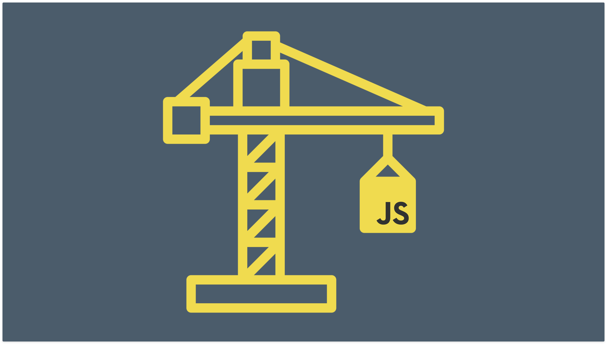
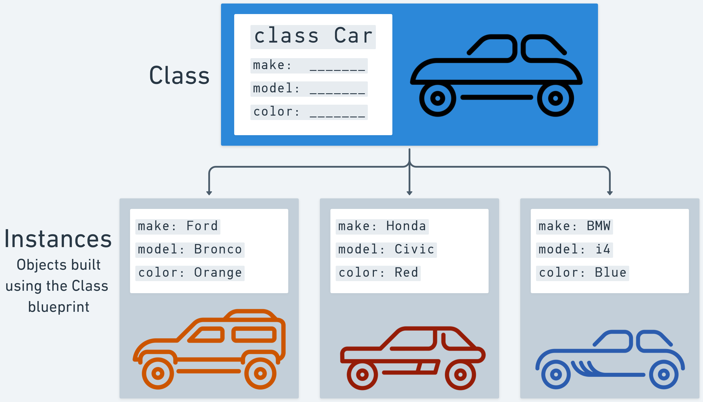
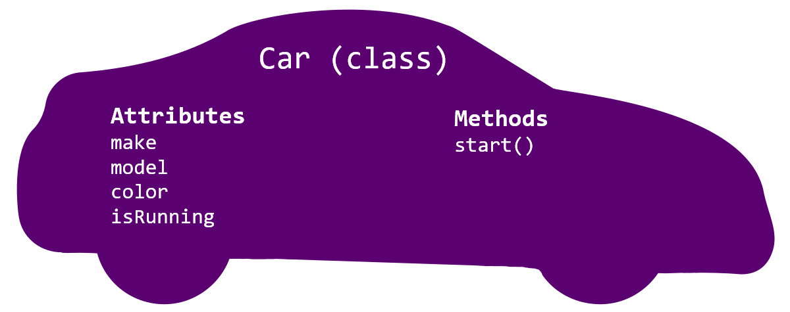
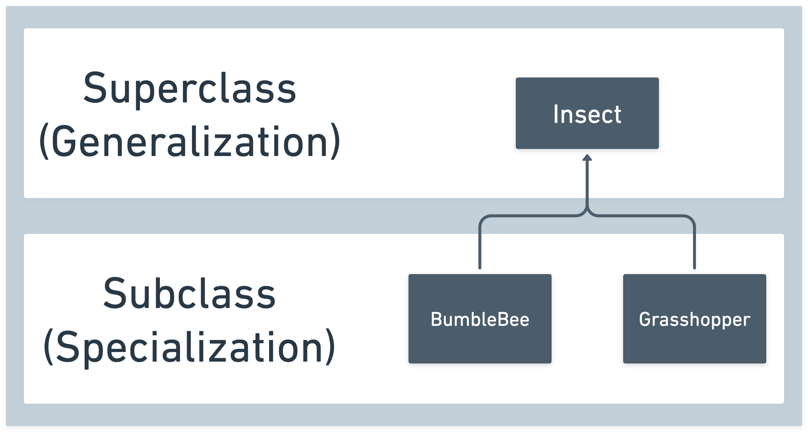
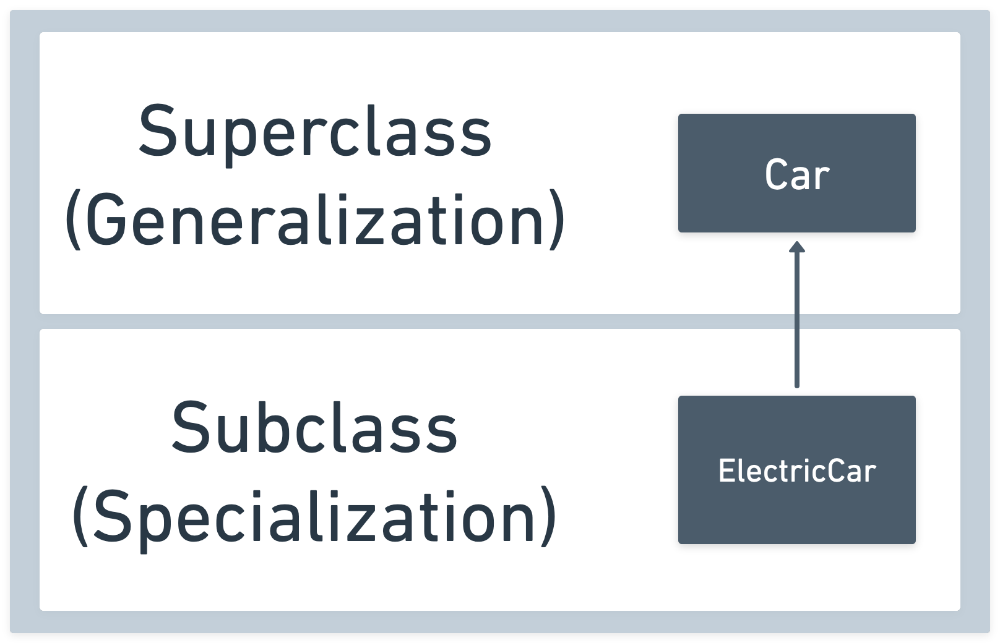
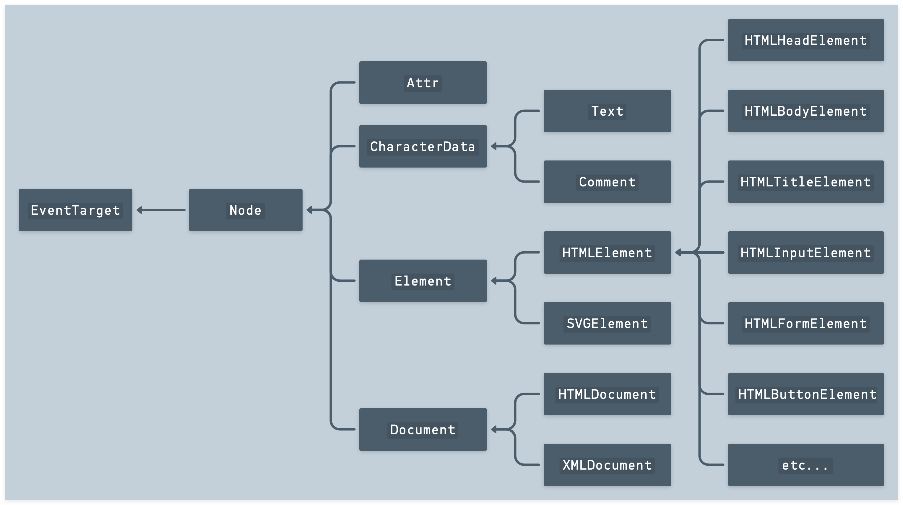

# JavaScript Classes



## Learning Objectives

| Students will be able to: |
| --- |
| Describe the use case for classes |
| Describe encapsulation in OOP |
| Define a class |
| Instantiate a class |
| Understand `this` at a basic level |
| Include and use a constructor method in a class |
| Define prototype (instance) methods in a class |
| Define static (class) methods |
| Define static (class) properties |
| Use `extends` to implement inheritance (create a subclass) |
| Use `super` within a subclass |

## Road Map

1. Setup
2. The use case of classes
3. Defining and instantiating a class and `this`
4. Defining prototype methods in a class
5. 💪 You Do - Define another class
6. Defining static methods and properties
7. Inheritance
8. Essential Questions
9. Further Study

## 1. Setup

1. Create a new HTML/CSS/JS-based Repl in [replit.com](https://replit.com/~)
2. Name it "JS Classes"

## 2. The use case of classes

### What are classes?

**Classes are used to create objects**!

In [object-oriented programming (OOP)](https://en.wikipedia.org/wiki/Object-oriented_programming), we use objects to model our application's purpose.

Think of classes as the blueprints used to create objects. These new objects are *instances* of that class.



### Why use classes?

<details>
<summary>
We've already been creating objects using object ___________ notation.
</summary>
<hr>

**literal**

<hr>
</details>

So why do we need classes to create objects then?

Continuing from our example above - imagine we are building an application for a car dealership, and we want to track their inventory of cars and modify it over time. We can't possibly know the make, model, and color of every car that the car dealership will ever sell when we build the application. 

Without classes, we would have to add a new object literal in the app's code every time the dealership buys a new car. Not a great use of anybody's time! To get around this, we can construct a `Car` class that defines what a car should be. In this example, a car has a make, a model, and a color.

## Encapsulation in OOP

[Encapsulation](https://en.wikipedia.org/wiki/Encapsulation_(computer_programming)) is a key principle of Object Oriented Programming.

Encapsulation is the concept of bundling data (properties/attributes) and related behavior (methods) within an object.

Let's build on this idea more with the cars we've constructed above - all of those car objects have three attributes:

- `make`
- `model`
- `color` 

These attributes are all data about a car! They describe what a car is and define its properties! So, what would an object with these properties look like?

```js
const hybridCar = {
  make: 'Toyota',
  model: 'Prius',
  color: 'black',
};
```

### ❓ What other attributes might a car have?

What about the behavior of a car? What can a car do? What can you do to a car? Let's start with the basics - a car needs to start, right? A `start()` method will do nicely then.

As you add behaviors you may also decide to create new attributes for a car - a `start()` method won't help us much unless we're also tracking if a car is currently running, so we should also create an `isRunning` attribute to support that behavior. Let's add those onto our object from above:

```js
const hybridCar = {
  make: 'Toyota',
  model: 'Prius',
  color: 'black',
  isRunning: false,
  start: function() {
    hybridCar.isRunning = true;
    console.log('Running!')
  },
};
```

### ❓ What other methods might a car have? Would new attributes need to be added to support those methods? If so, what are they?

### ❓ Review Questions - OOP

<details>
<summary>
(1) What does the acronym OOP stand for?
</summary>
<hr>

**Object-Oriented Programming**

<hr>
</details>

<details>
<summary>
(2) What are Classes used for in OOP?
</summary>
<hr>

**To create objects of a certain type.**

<hr>
</details>

<details>
<summary>
(3) Describe the OOP principle known as <em>encapsulation</em>.

</summary>
<hr>

**The bundling of data (properties/attributes) and related behavior (methods) within an object.**

<hr>
</details>

<details>
<summary>
(4) Assume we are making a <code>cohort</code> object - what could we encapsulate inside of it?

</summary>
<hr>

Many things! Here's an example.

**Attributes**

- subject
- students
- instructors

**Methods**

- addStudent
- pickRandomStudent

<hr>
</details>

## 3. Defining and instantiating a class and `this`



Let's write some code! We use the [class](https://developer.mozilla.org/en-US/docs/Web/JavaScript/Reference/Statements/class) keyword to define a class in JavaScript:

```js
class Car {
  // Code to define the class's properties and methods
};
```

If this looks similar to defining a function to you, that’s because classes are special functions with a couple of differences.

### ❓ What's different about the above `class` definition compared to a function? Do you notice anything different about the naming convention?

Although we haven't added anything to the class, we can still create an object (instance) from it if we want to (although it wouldn't do us much good).

### Instantiating a class (creating an object)

First, here's a bit more OOP vocabulary in regards to creating objects using a class:

- **Instance**: An object created by a class.
- **Instantiate**: We instantiate a class to create an object.
- **Instantiation**: The process of creating an object.

In JS, we create objects using the `new` keyword when invoking (instantiating) the class.

Let's create a `myCar` object:

```js
const myCar = new Car();
```

### The `constructor` method

When a class is instantiated, a special [constructor](https://developer.mozilla.org/en-US/docs/Web/JavaScript/Reference/Classes/constructor) method defined in the class will **automatically** be called.

The purpose of the `constructor` method is to initialize the data properties of the new object being created (represented by the `this` keyword - we'll get to this momentarily).

```js
class Car {
  constructor(make, model) {
    this.make = make;
    this.model = model;
    // return is not needed
    // because the new object is returned by default
  }
};
```

Now, we can pass the arguments that the `constructor` is counting on when instantiating the class:

```js
const myCar = new Car('Ford', 'Bronco');
console.log(myCar); // { make: "Ford", model: "Bronco" }
```

Very nice, but what in the world is `this`?

### What is `this`?

**`this` is a keyword in JavaScript** available for use inside of functions/methods (like our `constructor` above). The `this` keyword is a part of a function's **execution context**, which includes the code and everything that aids in its execution.

The mechanism provided by `this` is necessary for all object-oriented programming languages to:

1. **Provide access to an object's properties and methods** from other methods within that object
2. **Implement code reuse**

`this` has its value automatically set by the JavaScript engine when a function is invoked. This setting of a value is also known as *binding*. However, even though we **can** change the value of `this`, doing so is not common, so we'll focus on learning the rules that JavaScript uses to set `this` automatically. Some of these rules are explained below.

### Object instantiation - behind the scenes

When we invoke the class prefaced with the `new` keyword behind the scenes:

- JavaScript creates a shiny new empty object and assigns it to the `this` keyword when calling the `constructor` method.
- The `constructor` method is called with the arguments we provided when invoking the class. Remember, the `constructor` method is where we create/initialize properties on the new object assigned to `this`.
- After executing the `constructor`, the class automatically returns the shiny new object.

Although the `constructor` method is notable because it's called automatically, there's nothing special about how it's defined; other methods are defined the same way.

Don't worry if this is hard to grasp at first; `this` is a difficult concept - we'll return to it later in this lecture when we can provide a more concrete example. For now, what's most important to remember is that **`this` in the `constructor` function refers to the shiny new object being made whenever it is run! In this context, `this` is necessary because we can't know the object's name ahead of time.**

### 👉 You Do - Add another property, and instantiating a class

1. Modify the `Car` class by adding a property named `color`. Don't forget to add a new parameter to the `constructor` method.

2. Test it by instantiating another object of your choice. It should resemble the one below - you should add this line to your code as well; we'll use it later in this lesson.

    ```js
    const mySubaru = new Car('Subaru', 'Crosstrek', 'blue')
    ```

### Not all properties need a parameter in the constructor

We can create any number of properties for a new car object within the `constructor`.

For example, let's make sure a car isn't running when we build it:

```js
class Car {
  constructor(make, model, color) {
    this.make = make;
    this.model = model;
    this.color = color;
    this.isRunning = false; // default to false
  }
};
```

Now, any car we create will not be running when it pulls off the assembly line, and we don't need to pass any additional parameters to the constructor!

## 4. Defining prototype methods in a class

Two types of methods can be added to a class - [Prototype methods](https://developer.mozilla.org/en-US/docs/Web/JavaScript/Reference/Classes#methods) and [Static methods](https://developer.mozilla.org/en-US/docs/Web/JavaScript/Reference/Classes#static_methods_and_fields).

**Prototype methods** are available on an instance of the class (object) - this is why they are called _instance methods_ in other OOP languages. `forEach` is an example of a prototype method:

```js
const nums = [1, 2, 3, 4, 5];
nums.forEach(num => console.log(num));
```

Prototype methods are common, but another less common type of method can be defined.

**Static methods** are called on the class itself and are not available on instances. These are typically used to implement behavior that doesn't pertain to a specific instance.

[Array.isArray](https://developer.mozilla.org/en-US/docs/Web/JavaScript/Reference/Global_Objects/Array/isArray) is an example of a static method:

```js
const nums = [1, 2, 3, 4, 5];
console.log(Array.isArray(nums)); //-> true
```

### Defining prototype methods in a class

Let's add a prototype method called `start` to our `Car` class:

```js
class Car {
  // the constructor will always be called
  constructor(make, model, color) {
    this.make = make;
    this.model = model;
    this.color = color;
    this.isRunning = false;
  }
  start() {
    this.isRunning = true;
    console.log('Running!');
  }
};
```

Notice that methods are not separated by a comma or any other character.

Also, notice our friend `this` is back! We're using it outside of the constructor this time, so let's briefly talk about why.

Recall when we built a `hybridCar` object above:

```js
const hybridCar = {
  make: 'Toyota',
  model: 'Prius',
  color: 'black',
  isRunning: false,
  start: function() {
    hybridCar.isRunning = true;
    console.log('Running!');
  },
};
```

It had a `start` method, just like any car created using our `Car` class will, but instead of having to use `this.isRunning`, we were able to use `hybridCar.isRunning`. **Why is this?**

Think about how we instantiate a `Car`. We've done this together a couple of times, and you've done it on your own - **what must change each time we create a new car?**

The name of the shiny new object that gets created!

```js
const anythingWeWant = new Car(...)
```

`anythingWeWant` can be, well, anything we want!

Because we don't know the name of the object being created ahead of time, we cannot specify its name within the `start` method. Even if we knew the object's name, it wouldn't be very useful because our `start` method would only work with that single object!

In this case, `this` is useful because it abstracts away the specific object being made and says `this` will reference the current execution context - so when we say run the `anythingWeWant.start()` method, `anythingWeWant.isRunning` will be set to `true`!

As a final note - we could have also used `this.isRunning` instead of `hybridCar.isRunning` inside of the `hybridCar.start()` method as well - the end result would have been identical.

#### 👉 You Do - Add another instance method

1. Define a `stop` method in the `Car` class.

2. The `stop` method should set the `isRunning` property to `false` and log `"Stopped!"` to the console.

### Overriding methods

Thanks to another OOP principle called [inheritance](https://en.wikipedia.org/wiki/Inheritance_(object-oriented_programming)), **subclasses** inherit methods from their parent classes.

JavaScript implements inheritance differently from traditional OOP languages like Java or Python in that JavaScript's implementation is prototype-based.

We won't go into prototypes during this lesson because, thanks to the new class syntax we're currently learning about, knowing about prototypes isn't as important anymore. Check out the Further Study section for additional info.

In JavaScript, the `Object` class is at the top of the class hierarchy, and thus nearly all objects inherit its methods, such as [toString](https://developer.mozilla.org/en-US/docs/Web/JavaScript/Reference/Global_Objects/Object/toString):

```js
console.log(mySubaru.toString()) // something like: [object Object]
```

However, it's possible to override inherited methods by redefining that method.

For example, we can override/replace `Object`'s implementation of `toString` by defining it in the `Car` class:

```js
class Car {
  // the constructor will always be called
  constructor(make, model, color) {
    this.make = make;
    this.model = model;
    this.color = color;
    this.isRunning = false;
  }
  start() {
    this.isRunning = true;
    console.log('Running!');
  }
  toString() {
    return `This car is a ${this.color} ${this.make} ${this.model}.`;
  }
};
```

and now when we call the `toString()` method on `mySubaru`:

```js
console.log(mySubaru.toString()); // "This car is a blue Subaru Crosstrek"
```

So far, you've learned how to define a class that creates objects with properties and add prototype methods. This represents about 80% of what there is to know about classes - congrats! Sounds like a great time for you to try your hand at this!

## 5. 💪 Practice Exercise - Define another class

1. Pick something like our car example above that would make sense to instantiate. You can pick anything you'd like, but we'll use `Airplane` as an example. Remember that the class name should be uppercase and singular.
2. Code the class' `constructor` method so that it creates at least two properties.
3. Add at least two methods to the class. At least one of the methods you write should interact with one or multiple of the properties you created above. As you write your methods you might think of more properties you could add to the constructor - if you do, add them!
4. Create a couple of new instances of the class you've built.

## 6. Defining static methods and properties

Again, **static methods** and **static properties**, are accessible on a class itself - not on its instances.

### Static methods and properties

Static methods implement behavior that does not pertain to a particular instance. These are callable on the class itself - not on its instances. 

Static methods are typically used to implement behavior that does not pertain to a particular instance. For example, we could design the `Car` class so that it tracks every car it creates. We could then write static methods that return how many cars have been created, search for them by their make, and more.

Here’s how to define a basic static method:

```js
class Car {
  // the constructor will always be called
  constructor(make, model, color) {
    this.make = make;
    this.model = model;
    this.color = color;
    this.isRunning = false;
  }
  start() {
    this.isRunning = true;
    console.log('Running!');
  }
  toString() {
    return `This car is a ${this.color} ${this.make} ${this.model}.`;
  }
  static about() {
    console.log('I\'m the Car class!');
  }
};
```

The only difference is the `static` keyword that prefaces the method's name.

Try it out!

```js
Car.about(); // I'm the Car class! 
```

However, attempting to call `about` on the `mySubaru` instance leads to an error:

```js
mySubaru.about(); // Uncaught TypeError: mySubaru.about is not a function
```

## 7. Inheritance

In OOP, inheritance is when a new class is derived from an existing class to specialize it by:
- Adding additional properties
- Adding additional methods
- Overriding existing methods

The newly derived class is called a **derived** or **subclass**.

The original class is called a **base** or **superclass**.

A subclass automatically inherits all of the superclass's properties and methods - whether you want them all or not.



Above, the `Insect` superclass has the `BumbleBee` and `Grasshopper` subclasses derived from it. Class diagrams are typically drawn in a specific way as described by the [Unified Modeling Language's class diagram](https://en.wikipedia.org/wiki/Class_diagram) specifications, but we've simplified that here since those details aren't important to your understanding of this concept.

We're going to add a subclass called `ElectricCar` that will be derived from the `Car` superclass! Here's a diagram showing the relationship we will create.



### Using the `extends` keyword to create a subclass

We use the `extends` keyword to define a subclass.

```js
class ElectricCar extends Car {
  constructor(make, model, color, batteryCharge) {
    super(make, model, color);
    this.batteryCharge = batteryCharge;
  }
};
```

In a derived class, the [super](https://developer.mozilla.org/en-US/docs/Web/JavaScript/Reference/Operators/super) keyword represents the **parent superclass** and must be called before the `this` keyword can be used in the constructor. It can also be used to access properties of the superclass.

Additional properties like `batteryCharge` above can be initialized in the `constructor`. Instances of `ElectricCar` will have a `batteryCharge` property, while instances of `Car` will not. Let's build an electric car!

```js
const myVolvo = new ElectricCar('Volvo', 'EX30', 'Gray', 100); // Fully charged!
```

Determining which classes in a hierarchy to attach properties and methods to is difficult work, full of pitfalls and gotchas. This is one of the biggest hurdles to overcome when you're getting started with inheritance - it won't always be as clear-cut as it is above!

### Overriding methods

One last thing before we wrap up. Remember how we overrode the `toString()` method earlier? What if we also wanted to override the `start()` method provided by the `Car` class in the `ElectricCar` class? Check it:

```js
class ElectricCar extends Car {
  constructor(make, model, color, batteryCharge) {
    super(make, model, color);
    this.batteryCharge = batteryCharge;
  }
  start() {
    if (this.batteryCharge > 0) {
      this.isRunning = true;
      console.log('Your electric car is running!');
    } else {
      this.isRunning = false;
      console.log('Time to recharge!');
    };
  }
};
```

Very cool. Start up your electric car, quickly deplete the battery, and try to restart it.

```js
myVolvo.start() // "Your electric car is running!"
myVolvo.batteryCharge = 0
myVolvo.start() // "Time to recharge!"
```

## 8. ❓ Essential Questions

<details>
<summary>
(1) What are classes used for?
</summary>
<hr>

**Classes are used to create objects.**

<hr>
</details>

<details>
<summary>
(2) What is the name of the special method in a class that is automatically called when we instantiate a class?
</summary>
<hr>

**`constructor`**

<hr>
</details>

<details>
<summary>
(3) What is the main purpose of the above method?
</summary>
<hr>

**To initialize the properties on the shiny new object.**

<hr>
</details>

<details>
<summary>
(4) True or False: Prototype methods are called on a class.
</summary>
<hr>

**False**, prototype methods are called on instances (objects) of a class.

<hr>
</details>

<details>
<summary>
(5) What keyword in JavaScript is used to implement inheritance (create a subclass)?
</summary>
<hr>

**`extends`**

<hr>
</details>

## 9. Further study

### Example DOM Node Class Hierarchy

In complex systems, it's not uncommon to have several layers of inheritance. 

For example, let's take the suggested `Airplane` class from the Practice Exercise earlier. As you thought through that exercise you may have included properties that overlap with the existing `Car` model, like `make` or `model` - airplanes can have a make or model too, right? Maybe that would warrant creating a new class (perhaps `Vehicle`) to be a superclass of both the `Car` and `Airplane` classes.


With this example, you can start to see how class inheritance may play out in a larger application or system - below you can see a simplified class hierarchy for DOM elements:



Yes, that is actually oversimplified - the DOM is quite complex!

### Subclass JavaScript's built-in classes

It's possible to use `extends` to subclass JavaScript's built-in classes.

For example, it would be nice to have a `last` property on arrays that returns the last element of the array:

```js
class MyArray extends Array {
  get last() {
    return this[this.length - 1];
  }
}
```

You then would need to instantiate the `MyArray` class to create the specialized array:

```js
const nums = new MyArray(1, 2, 3, 4, 5);
console.log(nums.last); //-> 5
```

All other array properties and methods are available due to inheritance!

### Prototypal inheritance and the prototype chain 

Learn more about prototypal inheritance and the prototype chain [here in the docs](https://developer.mozilla.org/en-US/docs/Web/JavaScript/Inheritance_and_the_prototype_chain).

### Constructor functions - B.C. (Before Classes 😀)

Before classes arrived via ES2015, we used _constructor functions_ to do the same thing as classes.

No doubt, new code today will be written using the `class` keyword.

However, older code would have had to use _constructor functions_, so let's look at how the `Car` class can be written as a constructor function instead:

```js
function Car(make, model, color) {
  this.make = make;
  this.model = model;
  this.color = color;
  this.isRunning = false;  // default to false
};

Car.prototype.start = function() {
  this.isRunning = true;
  console.log('Running!');
};

// other prototype (instance) methods defined like above would go here
	
// Instantiation is identical
const car = new Car('Toyota', 'Camry', 'Green')

```

Static methods would be created directly on the constructor function:

```js
Car.about = function() {
  console.log('I\'m the Car class!');
};
```

## References

- [Classes on MDN](https://developer.mozilla.org/en-US/docs/Web/JavaScript/Reference/Classes)

- Old school [Prototypal Inheritance example](https://gist.github.com/jim-clark/e3fc426d73153fac6dc1)