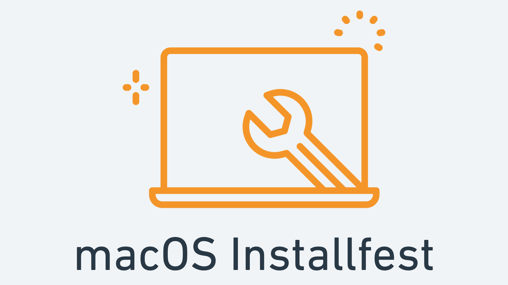

# macOS 13 Ventura and macOS 12 Monterey Python Installfest



## Python 3

Macs have come with Python 2 pre-installed for quite some time. However, Python 2 is obsolete - we need Python 3!

Python 3 might have been installed by Xcode, let's check by running:

```
python3 --version
```

If you received an error or if a version lower than Python 3.8.x is displayed, let's install Python using Homebrew...

### Installing Python 3

Let's have Homebrew install the latest version by running:

```
brew install python@3.11
```

One last step - let's make sure the `python3` command is using Python 3.11: 

In `~/.zshrc`, add the following line:
```
export PATH="$(brew --prefix)/opt/python@3.11/libexec/bin:$PATH"
```

You can test the installation by running `python3 --version`.


# PostgreSQL

PostgreSQL is a popular and robust Relational Database Management System (RDBMS).

Check if PostgreSQL is already installed by running this command:

```
psql
```

If you entered PostgreSQL's Interactive Shell, you already have PostgreSQL installed. Enter \q to exit the shell.

If you already have PostgreSQL installed, note the version and inform an instructor if it's not at least version 10.

Otherwise, let's use Homebrew once again...

### Install PostgreSQL

Install PostgreSQL using Homebrew with this command:

```
brew install postgresql@15
```

After Postgres is installed run this command:

```
brew services restart postgresql@15
```

Then run the following command to create a new database named the same as the current system user:

```
psql template1
```

In psql shell, `run CREATE DATABASE <your computer username exactly as it's written>;` <-this `;` is very important


